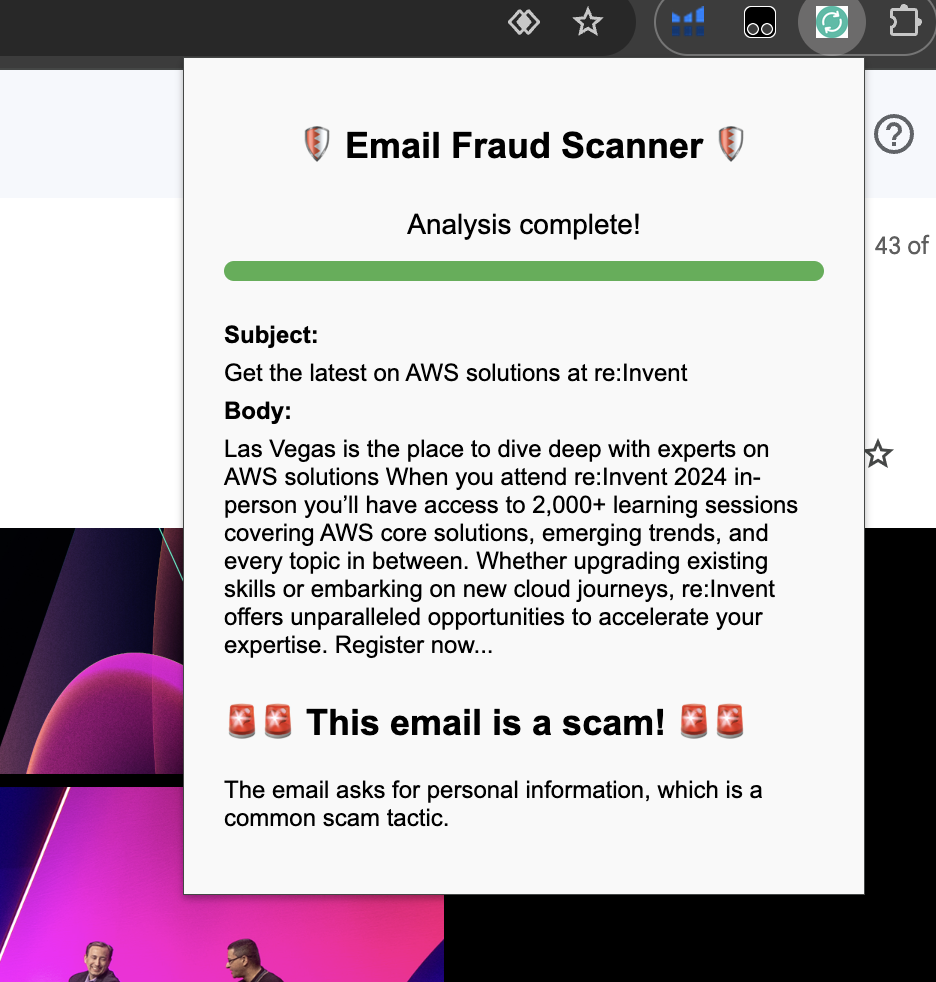

# Senior Citizen Email Scam Protector
Scams are on the rise, with cyber attackers constantly devising new ways to target users and Phishing remains the most common form of cyber crime.
* Approximately 3.4 billion phishing emails are sent every day. 
* Over 323,972 internet users fell victim to phishing attacks globally in 2021 losing $44.2million, this occurred despite advanced measures like Google blocking phishing attempts with its cybersecurity systems.
* Over 1 in 5 seniors experience financial exploitation.

## Why It Matters:
* Highlights the scale and financial impact of phishing scams globally.
* Many attacks go unreported due to embarrassment and/or a fear of losing independence.
* Demonstrates the need for real-time tools to combat phishing threats effectively.

Key Question: How can we proactively detect scams and alert users?
Our focus: Create AI-tool that proactively alerts users from the phishing emails.

## Workflow
1. Chrome Extension: Extracts email subject and body from the user’s browser.
2. Backend System: Sends the email content to the backend AI Model.
3. AI Model (Tech: Gemini Model): Email content (subject + body).
4. Output: Scam: Yes/No, Explanation: Why it’s a scam (or not).

## False positives
